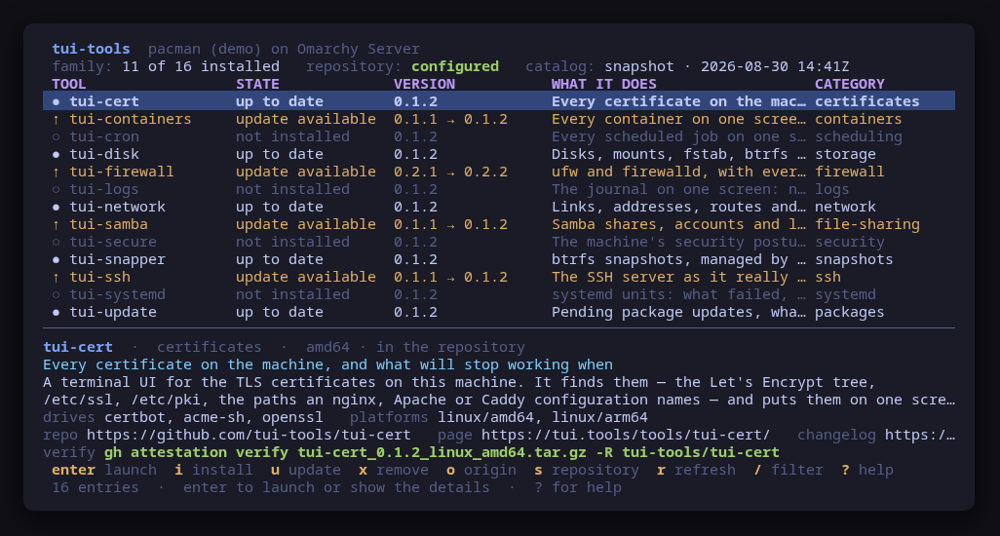
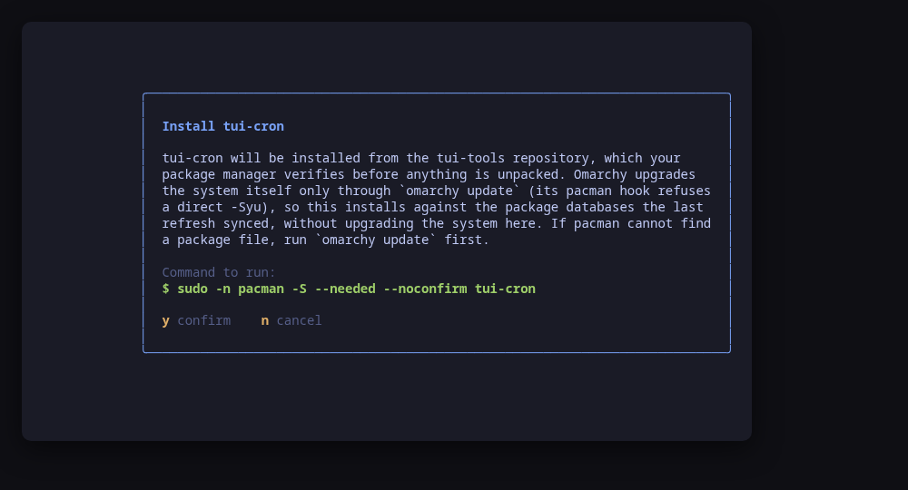
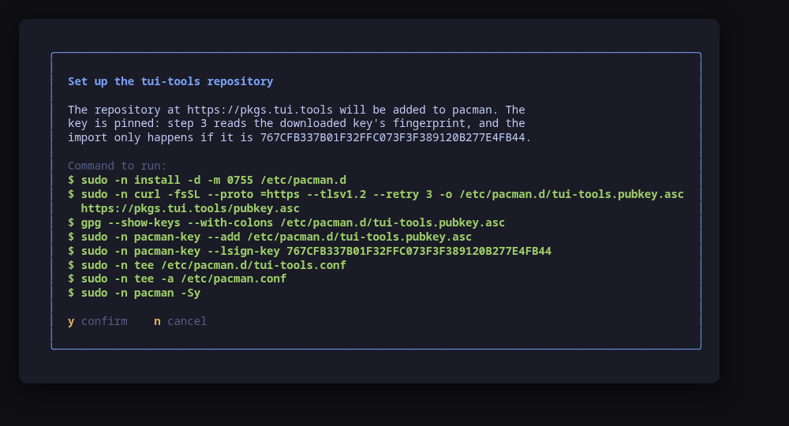
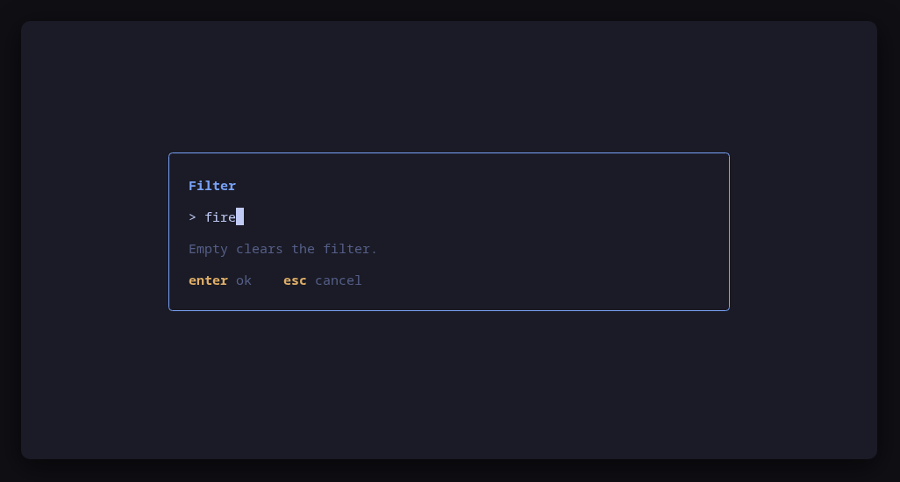
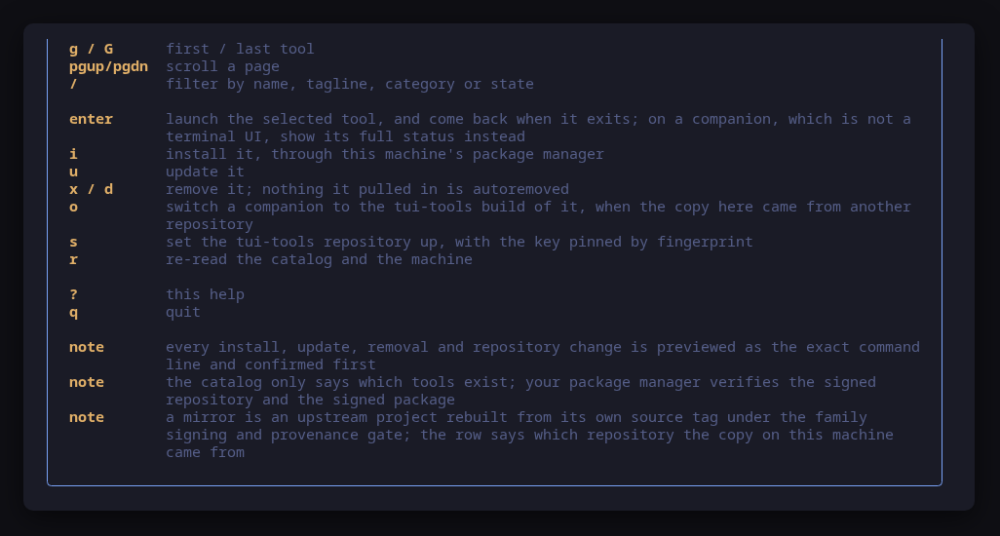

[](https://scorecard.dev/viewer/?uri=github.com/tui-tools/tui-tools)
[](https://www.bestpractices.dev/projects/14368)

> **Beta.** The family is days old and still changing. Package names, flags and keys may move without notice until 1.0. Pin versions, and report what breaks.

The launcher of the [tui-tools](https://tui.tools) family. Every tool of the
family is a card: what it does, whether this machine has it, which version, and
whether the repository is offering a newer one. Install, update and remove go
through the distribution's own package manager — `apt`, `dnf` or `pacman` — and
`enter` hands the terminal to an installed tool and takes it back when it exits.



> **Status: early, under validation.** An independent tool that follows the
> [Omarchy](https://omarchy.org) visual style; it is **not** part of the Omarchy
> project and not endorsed by its maintainers. Expect rough edges.

```sh
make demo     # a sample machine, where every key works and nothing is touched
```

## The trust boundary

**The catalog informs. The package manager verifies.**

`tui-tools` reads <https://tui.tools/catalog.json> to learn which tools exist,
what each one is called to a package manager, and which version the family
published. That document arrives over the network and is treated as a claim,
never as an authority:

- every name in it is held to `^tui-[a-z]+$` before it is kept, and held to it
  again by [`tui-kit/pkgmgr`](https://github.com/tui-tools/tui-kit) before it
  can reach an argv. Nothing else from the catalog ever reaches a command line
  — not a URL, not a version, not a description;
- what actually reaches the machine is decided by `apt`, `dnf` or `pacman`
  verifying the signed repository index and the signed package. This tool does
  not repeat that check and cannot weaken it. Reading the catalog is choosing
  what to *ask* the package manager for;
- the repository setup pins the signing key by fingerprint. The key is
  downloaded, its fingerprint is read back with `gpg --show-keys`, and the
  import only runs when it is
  `767CFB337B01F32FFC073F3F389120B277E4FB44` — the key you can check yourself
  with `curl -fsSL https://pkgs.tui.tools/pubkey.asc | gpg --show-keys`;
- a snapshot of the catalog is compiled into the binary. With no network, or
  with `--offline`, the dashboard shows that snapshot and the header says so.

And the family's own promise holds here as everywhere: **nothing changes the
machine without the exact command line on screen first.**





## Install

<!-- install:start -->
<!-- Generated by tui-kit/tools/render-install.py from tool.json. -->
<!-- Edit the manifest, then run `make readme`. -->

### Arch Linux

Needs the tui-tools repository, which is a [one-time
setup](https://tui-tools.github.io/install/).

The one-liner detects the distribution and adds the repository and its signing
key:

```sh
curl -fsSL https://pkgs.tui.tools/install.sh | sh
```

Piping a script into a shell is not this family's style, so here is the same
setup by hand — read it, or read the script first with `curl -fsSL
https://pkgs.tui.tools/install.sh -o install.sh`:

```sh
curl -fsSL -o /tmp/tui-tools.asc https://pkgs.tui.tools/pubkey.asc
sudo pacman-key --add /tmp/tui-tools.asc
sudo pacman-key --lsign-key \
  "$(gpg --show-keys --with-colons /tmp/tui-tools.asc | awk -F: '/^fpr:/{print $10; exit}')"
printf '[tui-tools]\nServer = https://pkgs.tui.tools/arch/$arch\n' \
  | sudo tee -a /etc/pacman.conf
sudo pacman -Sy
```

Then, and for every other tool in the family:

```sh
sudo pacman -S tui-tools
```

Upgrades then arrive with the rest of your system updates.

### Debian and Ubuntu

Needs the tui-tools repository, which is a [one-time
setup](https://tui-tools.github.io/install/).

The one-liner detects the distribution and adds the repository and its signing
key:

```sh
curl -fsSL https://pkgs.tui.tools/install.sh | sh
```

Piping a script into a shell is not this family's style, so here is the same
setup by hand — read it, or read the script first with `curl -fsSL
https://pkgs.tui.tools/install.sh -o install.sh`:

```sh
sudo install -d -m 0755 /etc/apt/keyrings
curl -fsSL https://pkgs.tui.tools/pubkey.asc \
  | sudo gpg --dearmor -o /etc/apt/keyrings/tui-tools.gpg
echo "deb [signed-by=/etc/apt/keyrings/tui-tools.gpg] https://pkgs.tui.tools/deb stable main" \
  | sudo tee /etc/apt/sources.list.d/tui-tools.list
sudo apt update
```

Then, and for every other tool in the family:

```sh
sudo apt install tui-tools
```

Upgrades then arrive with the rest of your system updates.

### Fedora and RHEL

Needs the tui-tools repository, which is a [one-time
setup](https://tui-tools.github.io/install/).

The one-liner detects the distribution and adds the repository and its signing
key:

```sh
curl -fsSL https://pkgs.tui.tools/install.sh | sh
```

Piping a script into a shell is not this family's style, so here is the same
setup by hand — read it, or read the script first with `curl -fsSL
https://pkgs.tui.tools/install.sh -o install.sh`:

```sh
sudo rpm --import https://pkgs.tui.tools/pubkey.asc
sudo curl -fsSL -o /etc/yum.repos.d/tui-tools.repo https://pkgs.tui.tools/rpm/tui-tools.repo
sudo dnf makecache
```

Then, and for every other tool in the family:

```sh
sudo dnf install tui-tools
```

Upgrades then arrive with the rest of your system updates.

### Any distribution, static binary

```sh
curl -fsSL https://github.com/tui-tools/tui-tools/releases/download/v0.1.0/tui-tools_0.1.0_linux_amd64.tar.gz | tar -xz tui-tools
sudo install -m0755 tui-tools /usr/local/bin/tui-tools
```

One static binary. Verify it against checksums.txt from the same release.

### From source

```sh
git clone https://github.com/tui-tools/tui-tools
cd tui-tools && make build
sudo install -m0755 bin/tui-tools /usr/local/bin/tui-tools
```

Needs Go 1.27 or newer.

Not packaged for these yet; the static binary works everywhere in the meantime.

### Arch Linux (AUR) — coming soon

```sh
paru -S tui-tools-bin
```

The -bin package installs the released static binary.

### openSUSE — coming soon

Needs the tui-tools repository, which is a [one-time
setup](https://tui-tools.github.io/install/).

```sh
sudo zypper install tui-tools
```

The rpm repository is shared with dnf; zypper support is not tested yet.

### Verify a download

Every release of `tui-tools` ships a `checksums.txt`. Check an archive against
it before installing:

```sh
sha256sum -c checksums.txt --ignore-missing
```
<!-- install:end -->

## Keys

| Key | What it does |
| --- | --- |
| `↑`/`k`, `↓`/`j` | Move the selection |
| `g` / `G` | First / last tool |
| `enter` | Launch the selected tool; the dashboard returns when it exits |
| `i` | Install it, through this machine's package manager |
| `u` | Update it |
| `x` / `d` | Remove it; nothing it pulled in is autoremoved |
| `s` | Set the tui-tools repository up, with the key pinned by fingerprint |
| `r` | Re-read the catalog and the machine |
| `/` | Filter by name, tagline, category or state |
| `?` | Help |
| `q` | Quit |



## What is on the screen

Each card carries the tool's name, what this machine has (`up to date`,
`update available 0.1.1 → 0.1.2`, `not installed`), what it does, and its
shelf. The marker on the left is the state — `●` installed, `↑` a newer version
is waiting, `○` not here, `!` no build for this architecture.

The pane underneath is the selected tool in full: its opening paragraph, the
backends it drives, the platforms it ships for, links to its repository, its
page on the family site and its changelog, and the one command that answers
"was this file built by that repository's workflow":

```sh
gh attestation verify tui-firewall_0.2.2_linux_amd64.tar.gz -R tui-tools/tui-firewall
```

The header says which package manager runs this machine, whether the tui-tools
repository is configured, and whether the catalog on screen is the live one or
the snapshot in the binary, with the time it was generated.



## Usage

```
tui-tools [flags]

  -catalog string   where to fetch the family catalog
  -check            read the machine and print the family's state as JSON
  -demo             a sample machine; nothing is installed, removed or started
  -offline          use the catalog snapshot embedded in this binary
  -sudo string      privilege escalation prefix, "" to disable
  -theme string     path to an Omarchy-style colors.toml
  -version          print the version and exit
```

### `--check`, for scripts and tests

`--check` is the read path with no UI: it fetches the catalog, asks the package
manager what is installed and what is offered, and prints the result. It never
builds and never runs an install, an update, a removal or a repository setup,
so it is safe to run anywhere.

```console
$ tui-tools --check | jq '{manager, repo: .repo.configured, catalog: .catalog.source, summary}'
{
  "manager": "dnf",
  "repo": true,
  "catalog": "live",
  "summary": {
    "total": 14,
    "installed": 5,
    "outdated": 0,
    "missing": 9
  }
}
```

The exit code says whether the tool worked, not whether the machine is up to
date: a machine with nothing installed is a successful run, and the news is in
`summary`.

## What it can do to your machine

Four things, each of them previewed as the exact command sequence and confirmed
first:

- **install** a tool — a metadata refresh, then the manager's install;
- **update** one. On `pacman` that is `-Syu` with the tool named, because Arch
  has no supported way to upgrade one package against a refreshed database
  without upgrading the machine with it, and pretending otherwise is how a
  partial upgrade breaks a system. The dialog says so before it runs;
- **remove** one. Nothing else goes with it: the dependencies it pulled in are
  left alone, because an autoremove decided by a launcher is how an unrelated
  package disappears;
- **set the repository up**, with the signing key pinned by fingerprint.

Reading takes no privileges at all. Which tools are installed and which the
repositories offer are local database queries any user may make, and none of
them refreshes the manager's metadata behind you — that refresh is a privileged
write, and it is the first previewed step of an install rather than a side
effect of looking.

Launching is not a change and is not previewed as one: `enter` starts another
tool of the family, and that tool previews and confirms whatever *it* changes.

## Packaging

The `tui-tools` package installs the launcher and nothing else. It deliberately
does **not** depend on the tools it can install: a launcher that drags fourteen
programs onto a machine has taken the choice the dashboard exists to offer.

The `.deb` and the `.rpm` carry the fourteen tools as `Suggests`, which is the
weakest relation both ecosystems have — apt lists them and installs nothing,
and `dnf` does not pull a `Suggests` in, unlike a `Recommends`, which it would
install by default. The pacman package carries no hint: nfpm's archlinux
packager writes only `depends`, `provides`, `conflicts` and `replaces`, and a
faked `optdepends` is worse than none.

## Configuration

`/etc/tui-tools/config.toml`, then `~/.config/tui-tools/config.toml`, then
`TUI_TOOLS_*` in the environment, then the flags. See
[`examples/config.toml`](examples/config.toml).

```toml
# Where the family catalog is fetched from.
catalog = "https://tui.tools/catalog.json"
# Never fetch it; use the snapshot built into this binary.
offline = false
# Privilege escalation prefix; "" runs the commands directly.
sudo = "sudo -n"
# Path to an Omarchy-style colors.toml; empty follows the active theme.
theme = ""
```

## Theme

The default palette is Tokyo Night. On a machine running
[Omarchy](https://omarchy.org) the active desktop theme is read from
`~/.config/omarchy/current/theme/colors.toml` and followed, so switching the
desktop theme switches every tool of the family. `TUI_THEME` or `--theme` point
at any Omarchy-format `colors.toml`; `NO_COLOR` is respected.

## Architecture

```
cmd/tui-tools/        flags, the Bubble Tea model, the four bands, --check
internal/catalog/     the catalog: fetch, validate, embed a snapshot, build rows
internal/packages/    the backend: tui-kit/pkgmgr, the pinned key, the handover
```

`internal/packages` is the only package that may start a process, which is what
`tui-kit/tools/check-exec.sh` asserts on every build. Every command is built as
a value by `tui-kit/pkgmgr`, previewed by `ui.Confirm`, and handed back to the
kit runner to execute — so the command line in the dialog is the command line
that runs.

## Compatibility

<!-- compat:start -->
<!-- Generated by tui-kit/tools/render-compat.py from tool.json. -->
<!-- Edit the manifest, then run `make readme`. -->

`tui-tools` probes its backend once at startup and shows the version in the
header. A version nobody has tested is marked `(untested)` there rather than
hidden; one below the minimum is marked as such and the tool still runs.

### pacman

| | |
| --- | --- |
| Binary | `pacman` |
| Version read with | `pacman --version` |
| Minimum | 6.0 |
| Tested | none yet |

| Versions | What changes |
| --- | --- |
| `>=6.0` | Arch has no supported way to upgrade one package against a refreshed database without upgrading the machine with it, so an update here is `pacman -Syu` with the tool named, and the confirm dialog says so before it runs |
| `>=6.0` | the repository setup writes a `[tui-tools]` section under /etc/pacman.d and adds one Include line to pacman.conf, so a later setup finds it again instead of appending a second block |

### apt

| | |
| --- | --- |
| Binary | `apt` |
| Version read with | `apt --version` |
| Minimum | 2.0 |
| Tested | none yet |

| Versions | What changes |
| --- | --- |
| `>=2.0` | the available version comes from `apt-cache policy`, which reads the lists already on disk; a repository added a moment ago reports nothing until the refresh, which is the first previewed step of an install rather than something the read path does behind you |

### dnf

| | |
| --- | --- |
| Binary | `dnf` |
| Version read with | `dnf --version` |
| Minimum | 4.0 |
| Tested | none yet |
| Version-gated features | `dnf5` (since 5.0) |

| Versions | What changes |
| --- | --- |
| `>=5.0` | `dnf --version` prints `dnf5 version 5.2.18.0`, where dnf4 prints a bare `4.24.0` on its first line; both are read by the same pattern, which keeps three components because a four-part version is not one the family schema records |
| `>=4.0` | the available version comes from `dnf repoquery`, which answers from the cache on disk, so a machine whose metadata has expired reports what it last fetched rather than refreshing behind you |

The tested versions are generated from `compat/results.jsonl`, which the tool's
own smoke test appends to when it runs against a real machine in
[tui-lab](https://github.com/tui-tools/tui-lab).
<!-- compat:end -->

## Development

```sh
make check        # gofmt, vet, the exec boundary, golangci-lint and the tests
make demo
make screenshots  # re-render the README frames from --demo
make catalog      # refresh the embedded catalog snapshot and validate it
make readme       # regenerate the Install and Compatibility sections
make manifest     # validate tool.json and the package metadata
```

The catalog is the one document this launcher reads and did not write, so
`internal/catalog` carries a fuzz target over its parser. `make check` replays
its seeds like any other test; exploring past them is something you run when
you touch the parser:

```sh
go test -run=^$ -fuzz=FuzzParse -fuzztime=5m ./internal/catalog/
```

A crash writes its input under `testdata/fuzz/`; commit that file and it
becomes a seed the tests replay forever. The family rule is
[tui-kit/templates/FUZZING.md](https://github.com/tui-tools/tui-kit/blob/main/templates/FUZZING.md).

Tags are annotated, and the message is the release notes: GoReleaser renders it
above the generated commit list, so a release opens with a sentence somebody
wrote rather than a list of commit subjects.

```sh
git tag -a v0.2.0 -m "What changed for somebody running the tool."
git push origin v0.2.0
```

## Contributing

Contributions arrive as pull requests: [tui-kit's
CONTRIBUTING.md](https://github.com/tui-tools/tui-kit/blob/main/CONTRIBUTING.md)
is the family's process and the bar a change has to clear. A security problem
is reported the way [tui-kit's
SECURITY.md](https://github.com/tui-tools/tui-kit/blob/main/SECURITY.md)
describes, privately, never in a public issue.

## License

MIT — see [LICENSE](LICENSE). Part of the
[tui-tools](https://github.com/tui-tools) family.
