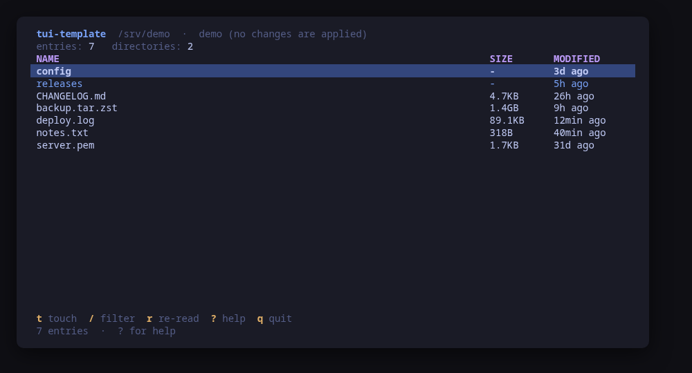
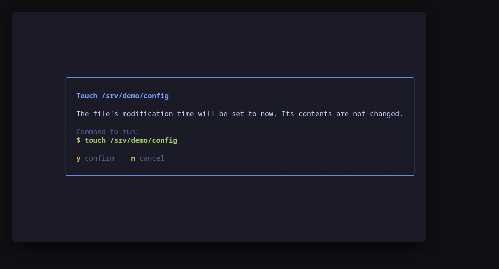

[](https://scorecard.dev/viewer/?uri=github.com/tui-tools/tui-template)

# tui-template

The starting point for a new [tui-tools](https://github.com/tui-tools) tool.
Press **Use this template**, rename it, replace one package, and you have a tool
that looks and behaves like the rest of the family.

It is not a pile of TODOs: it is a working tool. It lists the files in a
directory and can update a file's timestamp, which is deliberately trivial —
what matters is the shape around it, and that shape is already correct.





```sh
make demo     # try it before changing anything
```

## Install

The section below is **generated from `tool.json`** by
`tui-kit/tools/render-install.py`, so the README and the family website never
disagree about how a tool is installed. Run `make readme` after editing the
manifest, and again after a release, since the download line names the version.

<!-- install:start -->
<!-- Generated by tui-kit/tools/render-install.py from tool.json. -->
<!-- Edit the manifest, then run `make readme`. -->

### From source

```sh
git clone https://github.com/tui-tools/tui-template
cd tui-template && make demo
```

Or press "Use this template" on GitHub, which is the point of it.

Not packaged for these yet; the static binary works everywhere in the meantime.

### Arch Linux — coming soon

Needs the tui-tools repository, which is a [one-time
setup](https://tui-tools.github.io/install/).

The one-liner detects the distribution and adds the repository and its signing
key:

```sh
curl -fsSL https://pkgs.tui.tools/install.sh | sh
```

Piping a script into a shell is not this family's style, so here is the same
setup by hand — read it, or read the script first with `curl -fsSL
https://pkgs.tui.tools/install.sh -o install.sh`:

```sh
curl -fsSL -o /tmp/tui-tools.asc https://pkgs.tui.tools/pubkey.asc
sudo pacman-key --add /tmp/tui-tools.asc
sudo pacman-key --lsign-key \
  "$(gpg --show-keys --with-colons /tmp/tui-tools.asc | awk -F: '/^fpr:/{print $10; exit}')"
printf '[tui-tools]\nServer = https://pkgs.tui.tools/arch/$arch\n' \
  | sudo tee -a /etc/pacman.conf
sudo pacman -Sy
```

Then, and for every other tool in the family:

```sh
sudo pacman -S tui-template
```

The template is never packaged. Your tool's channel turns available once its
first release lands in pkgs.tui.tools.

### Debian and Ubuntu — coming soon

Needs the tui-tools repository, which is a [one-time
setup](https://tui-tools.github.io/install/).

The one-liner detects the distribution and adds the repository and its signing
key:

```sh
curl -fsSL https://pkgs.tui.tools/install.sh | sh
```

Piping a script into a shell is not this family's style, so here is the same
setup by hand — read it, or read the script first with `curl -fsSL
https://pkgs.tui.tools/install.sh -o install.sh`:

```sh
sudo install -d -m 0755 /etc/apt/keyrings
curl -fsSL https://pkgs.tui.tools/pubkey.asc \
  | sudo gpg --dearmor -o /etc/apt/keyrings/tui-tools.gpg
echo "deb [signed-by=/etc/apt/keyrings/tui-tools.gpg] https://pkgs.tui.tools/deb stable main" \
  | sudo tee /etc/apt/sources.list.d/tui-tools.list
sudo apt update
```

Then, and for every other tool in the family:

```sh
sudo apt install tui-template
```

The template is never packaged. Your tool's channel turns available once its
first release lands in pkgs.tui.tools.

### Fedora and RHEL — coming soon

Needs the tui-tools repository, which is a [one-time
setup](https://tui-tools.github.io/install/).

The one-liner detects the distribution and adds the repository and its signing
key:

```sh
curl -fsSL https://pkgs.tui.tools/install.sh | sh
```

Piping a script into a shell is not this family's style, so here is the same
setup by hand — read it, or read the script first with `curl -fsSL
https://pkgs.tui.tools/install.sh -o install.sh`:

```sh
sudo rpm --import https://pkgs.tui.tools/pubkey.asc
sudo curl -fsSL -o /etc/yum.repos.d/tui-tools.repo https://pkgs.tui.tools/rpm/tui-tools.repo
sudo dnf makecache
```

Then, and for every other tool in the family:

```sh
sudo dnf install tui-template
```

The template is never packaged. Your tool's channel turns available once its
first release lands in pkgs.tui.tools.

### Any distribution, static binary — coming soon

```sh
curl -fsSL https://github.com/tui-tools/tui-template/releases/download/v0.1.0/tui-template_0.1.0_linux_amd64.tar.gz | tar -xz tui-template
sudo install -m0755 tui-template /usr/local/bin/tui-template
```

The template is never released. Your tool is, once you tag v0.1.0.

### Verify a download

Every release of `tui-template` ships a `checksums.txt`. Check an archive
against it before installing:

```sh
sha256sum -c checksums.txt --ignore-missing
```
<!-- install:end -->

## What you get

| From the kit | What it gives you |
| --- | --- |
| `theme` | Tokyo Night, Omarchy theme detection, `NO_COLOR` |
| `ui` | Header, table, help bar, help screen, status line, dialogs |
| `config` | `/etc/<tool>/…` + `~/.config/<tool>/…` + environment + flags |
| `runner` | Preview → confirm → run, escalation, timeouts, and a fake |

| In this repository | What it is |
| --- | --- |
| `cmd/tui-template/main.go` | Flags, configuration, backend selection, program start |
| `cmd/tui-template/app.go` | The Bubble Tea model: one flat update loop |
| `cmd/tui-template/view.go` | The four bands every screen draws |
| `internal/tool/tool.go` | Your model, your action table, your backend interface |
| `internal/tool/real.go` | The backend that touches the machine |
| `internal/tool/fake.go` | The in-memory backend behind `--demo` and the tests |
| `internal/tool/tool_test.go` | The two assertions that matter |
| `tool.json` | The manifest the family website reads: tagline, category, keys, install, security |
| `.github/workflows/ci.yml` | gofmt, vet, race tests, cross-build, tool.json validation, release on a tag |
| `.goreleaser.yaml` | Static linux/amd64 and linux/arm64 archives |
| `Makefile` | `check`, `build`, `demo`, `screenshots` |

## Checklist for a new tool

**1. Pick the name.** Every tool is `tui-<target>`: the repository, the Go
module, the package directory, the binary and the config directory all carry
that one name, with **no aliases**. `tui-firewall`, `tui-systemd`. Use
`tui-<name>-<solution>` only when a target genuinely needs disambiguating.

**2. Rename everything at once.**

```sh
NEW=tui-yourtool
git mv cmd/tui-template "cmd/$NEW"
grep -rl tui-template --include='*.go' --include='*.md' --include='*.yaml' \
  --include='*.yml' --include='*.toml' . Makefile |
  xargs sed -i "s/tui-template/$NEW/g"
go mod edit -module "github.com/tui-tools/$NEW"
go mod tidy && make check
```

**3. Replace `internal/tool`.** Rename the package to your subject
(`internal/systemd`, `internal/containers`). Then, in order:

- **the model** — the struct one row of your list holds, and the sort that puts
  what matters on top;
- **the action table** — one `ActionSpec` per key. The key map, the help screen
  and the confirm dialog are all generated from it, so they cannot drift apart;
- **`BuildCommand`** — intent to argv. Nothing else in the tool may build a
  command line;
- **`Real`** — one `runner.New` per binary you drive, and the reads;
- **`Fake`** — the sample data `--demo` shows, and a `Hook` that applies a
  confirmed command to it the way the real one would.

**4. Adjust the view.** Columns in `view.go`, the header facts, and the widths
at which columns are dropped. Check it at 40 columns as well as 120.

**5. Fill in `tool.json`.** It is the manifest the family website reads, and
the copy in this repository is a valid example rather than a set of TODOs.
Replace the tagline (80 characters at most), the description, the category, the
keys worth advertising, the install commands and — most carefully — the
`security` block, which the site renders as a checklist a reader trusts. Drop
`"unreleased": true` once you have tagged. The fields are documented in
[tui-kit/docs/tool-manifest.md](https://github.com/tui-tools/tui-kit/blob/main/docs/tool-manifest.md),
and `make manifest` validates yours against the schema — CI runs the same check,
so a manifest that drifts fails the build.

The `install` channels stay `"available": false` in the template, and they
should stay false in your tool until it has actually shipped. A channel is a
promise: `available: true` renders the command as one a reader can run today,
and the family website lists the tool as installable from that package manager.
Tag `v0.1.0`, let the release build the `.deb`, the `.rpm` and the pacman
package, and wait for the next `pkgs.tui.tools` publish to pick them up — then
flip `pacman`, `apt` and `dnf` to `true` and run `make readme`. `zypper` and
`aur` stay false across the family; nothing publishes to them yet.

**6. Declare the backend you drive.** The `backends[]` block of `tool.json`
names the binary, how to read its version, the oldest version you support, the
features that appeared in a known release and the caveats that apply to a
range. `cmd/<tool>/compat.go` probes it once at startup and the header shows
what it found, so a user on an unusual version learns it from the tool rather
than from an empty screen. Ask `caps.Has("your-feature")` where a view needs a
recent backend; never write a version comparison into the code. `tested` is
generated from `compat/results.jsonl` by `make compat` after a run in
[tui-lab](https://github.com/tui-tools/tui-lab) — see
[tui-kit/docs/compatibility.md](https://github.com/tui-tools/tui-kit/blob/main/docs/compatibility.md).
A tool that drives nothing external drops the block, `compat.go` and the header
fact together.

**7. Re-render the screenshots.** `make screenshots` runs the real binary in
`--demo` under a pseudo-terminal, so the README frames are the actual UI:

```make
screenshots: build
	python3 $(KIT)/tools/render-screenshots.py \
		--bin $(BIN)/$(TOOL) --name $(TOOL) --out docs/screenshots \
		--screen main= --screen touch=t --screen help=?
```

Each `--screen` is `name=keys`; the keys are typed once the UI has drawn.

**8. Set the repository up.** Description, topics (`tui`, `terminal`,
`bubbletea`, `go`, `golang`, `omarchy`, plus yours), issues on, wiki and
projects off, delete-branch-on-merge on. Then add the tool to the family list in
[tui-tools/.github](https://github.com/tui-tools/.github).

**9. Release.** `git tag v0.1.0 && git push origin v0.1.0`, then `make readme`
to put the new version in the download line. CI runs the checks
and GoReleaser attaches the static binaries. The tool then appears on
[tui-tools.github.io](https://tui-tools.github.io) on its next build, which is
hourly.

## Compatibility

<!-- compat:start -->
<!-- Generated by tui-kit/tools/render-compat.py from tool.json. -->
<!-- Edit the manifest, then run `make readme`. -->

`tui-template` probes its backend once at startup and shows the version in the
header. A version nobody has tested is marked `(untested)` there rather than
hidden; one below the minimum is marked as such and the tool still runs.

### coreutils

| | |
| --- | --- |
| Binary | `touch` |
| Version read with | `touch --version` |
| Minimum | 8.0 |
| Tested | none yet |
| Version-gated features | `no-dereference` (since 8.1) |

| Versions | What changes |
| --- | --- |
| `<8.1` | `touch -h` is missing, so the timestamp of a symlink is set on its target instead of on the link |

The tested versions are generated from `compat/results.jsonl`, which the tool's
own smoke test appends to when it runs against a real machine in
[tui-lab](https://github.com/tui-tools/tui-lab).
<!-- compat:end -->

## The rules

These are what make the family a family rather than a folder of unrelated
programs. Keep them, or the tool does not belong in it.

- **Preview, then confirm.** Nothing changes the system without first showing
  the exact command line. Build a `runner.Command`, show it with `ui.Confirm`,
  hand that same value back to the runner. The dialog is the only path to a
  mutation.
- **Read-only by default.** Starting the tool only reads.
- **No daemon, no state of its own.** The system is the source of truth; re-read
  it after every change.
- **`--demo` always works.** It builds and previews every command for real, and
  touches nothing. A reviewer must be able to try the tool without a machine to
  risk.
- **Backend behind an interface.** The UI never names a binary.
- **Small dependencies.** Bubble Tea, Bubbles, Lip Gloss and the kit.
- **English everywhere**: code, comments, commits, UI strings.
- **Responsive.** Layouts adapt from a 40-column pane to a full screen.

## Tests worth writing

`internal/tool/tool_test.go` shows the two that carry the tool:

- **the command that runs is the command the preview showed**, character for
  character — assert on `Fake.Commands()` after driving a key;
- **nothing runs that was not confirmed** — cancel, then assert the fake
  recorded nothing.

Then table tests for every parser, against real command output pasted in
verbatim. When a parser is wrong on someone's machine, their output becomes the
next case.

## License

MIT — see [LICENSE](LICENSE). Part of the
[tui-tools](https://github.com/tui-tools) family.
